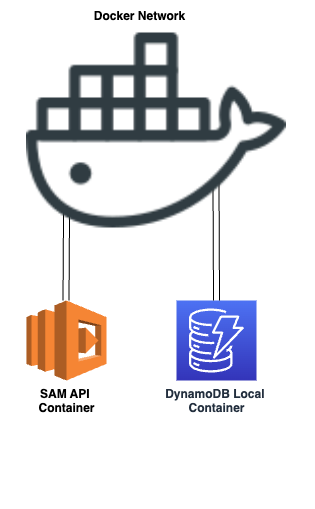

## Table of Contents
- [About](#about)
- [Installation](#installation)
- [Usage](#usage)
- [PostMan collection](#postman-collection)
- [Handy commands](#handy-commands)
- [Sample code](#sample-code)

## About:

Local Lambda DynamoDb setup using [AWS Serverless Application Model(SAM)](https://docs.aws.amazon.com/serverless-application-model/latest/developerguide/install-sam-cli.html) and [DynamoDB local](https://hub.docker.com/r/amazon/dynamodb-local/) using Docker.
<div align="center" style="width:800px">

</div>

## Installation :

 - Install the following on your computer:
    1. [NodeJS](https://nodejs.org/en/download/)
    2. [Docker](https://www.docker.com/)
    3. [AWS CLI](https://aws.amazon.com/cli/)
    4. [SAM CLI](https://docs.aws.amazon.com/serverless-application-model/latest/developerguide/serverless-sam-cli-install.html)
    5. [NoSQL Workbench](https://docs.aws.amazon.com/amazondynamodb/latest/developerguide/workbench.html)
    
 - Clone the repository: `git clone git@github.com:daniel-bleoju/AWSLambdaDynamoDBlocal.git`
 - Create Docker network `docker network create local-api-network`
 - DynamoDB Local Setup `docker run -d -p 8000:8000 --network=local-api-network --name dynamo-local amazon/dynamodb-local`

 ## Usage

 - Start sam locally `sam local start-api --docker-network local-api-network`

 ## Sample code

 <h4> Connect to DynamoDB: </h4>

```
const dynamoDb = require('aws-sdk/clients/dynamodb');
const documentClient = new dynamoDb.DocumentClient({'endpoint': 'http://dynamo-local:8000'});
```
We're using the parameter `{'endpoint': 'http://dynamo-local:8000'}` only for local.

<h4> Get an item from a table:</h4> 

```
const params = {
  TableName : 'Table',
  Key: {
    HashKey: 'hashkey'
  }
};
const documentClient = new new dynamoDb.DocumentClient();
documentClient.get(params, function(err, data) {
  if (err) console.log(err);
  else console.log(data);
});
```

<h4> Create an item:</h4>

```
const params = {
  TableName : 'Table',
  Item: {
     HashKey: 'haskey',
     NumAttribute: 1,
     BoolAttribute: true,
     ListAttribute: [1, 'two', false],
     MapAttribute: { foo: 'bar'},
     NullAttribute: null
  }
};
const documentClient = new dynamoDb.DocumentClient();
documentClient.put(params, function(err, data) {
  if (err) console.log(err);
  else console.log(data);
});
```

<h4> Update an item:</h4>

```
const params = {
  TableName: 'Table',
  Key: { HashKey : 'hashkey' },
  UpdateExpression: 'set #a = :x + :y',
  ConditionExpression: '#a < :MAX',
  ExpressionAttributeNames: {'#a' : 'Sum'},
  ExpressionAttributeValues: {
    ':x' : 20,
    ':y' : 45,
    ':MAX' : 100,
  }
};
const documentClient = new dynamoDb.DocumentClient();
documentClient.update(params, function(err, data) {
   if (err) console.log(err);
   else console.log(data);
});
```

<h4>Query an index: </h4>

```
const params = {
  TableName: 'Table',
  IndexName: 'Index',
  KeyConditionExpression: 'HashKey = :hkey and RangeKey > :rkey',
  ExpressionAttributeValues: {
    ':hkey': 'key',
    ':rkey': 2015
  }
};
const documentClient = new dynamoDb.DocumentClient();
documentClient.query(params, function(err, data) {
   if (err) console.log(err);
   else console.log(data);
});
```
<h4>Delete an item: </h4>

```
const params = {
  TableName : 'Table',
  Key: {
    HashKey: 'hashkey',
    NumberRangeKey: 1
  }
};
const documentClient = new dynamoDb.DocumentClient();
documentClient.delete(params, function(err, data) {
  if (err) console.log(err);
  else console.log(data);
});
```

## Postman collection

`./Local AWS.postman_collection.json`

## Handy commands
 - Check if dynamo db is running `aws dynamodb list-tables --endpoint-url http://localhost:8000`


